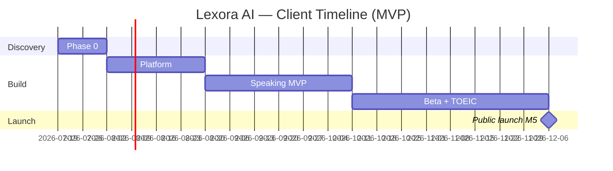

# Lexora AI — Client Proposal (Documentation Package)

**Version:** 1.0
**Date:** 2026-07-19
**Prepared for:** Client / stakeholder review
**Status:** Ready for proposal presentation

> **Learn Smarter. Speak Better.**

**Repository:** [github.com/anhthqb97/Lexora-AI](https://github.com/anhthqb97/Lexora-AI)  
**Full technical review:** [`REVIEW-SIGNOFF.md`](REVIEW-SIGNOFF.md)  
**Documentation hub:** [`README.md`](README.md)

---

## 1. Executive summary

Lexora AI is an **AI-powered English learning platform** built for **Vietnamese learners**, launching first with:

1. **Lexora Speaking** — AI conversation coach with speech evaluation and explain-why feedback  
2. **Lexora TOEIC** — Adaptive prep with mock exams and score tracking  

**MVP delivery:** 20 weeks after discovery (Week 20 public launch)  
**Primary market:** Vietnam · **Expansion:** Southeast Asia  
**MVP form factor:** Responsive web (mobile browser); native apps in Phase 1c after retention targets  

This package contains **complete planning documentation** — requirements, architecture, system design, execution plans, QA, and AI specifications — ready to begin **Phase 0 discovery** immediately upon approval.

---

## 2. What we propose to build (MVP scope)

| In scope (Phase 1) | Out of scope (later phases) |
|---|---|
| User auth (email, OTP, OAuth) | Native iOS/Android apps (Phase 1c) |
| Onboarding + learner dashboard | IELTS / TOEFL prep (Phase 2) |
| Lexora Speaking — full session loop | Writing / Business English (Phase 2) |
| TOEIC diagnostic + 1 mock exam | B2B / Enterprise / Schools (Phase 2–3) |
| MoMo + VNPay payments | Self-hosted LLM (Phase 2+) |
| Vietnamese-first UX | Kubernetes / microservices day 1 |

**Free tier:** 3 speaking sessions/week · 1 TOEIC mock/month  
**Differentiator:** Explain-why feedback — not just scores, but *why* and *how to improve*

---

## 3. Timeline & milestones

| Phase | Duration | Outcome | Milestone |
|---|---|---|---|
| **Phase 0** | 2 weeks | PRD sign-off, spikes, env setup | **M0** — Discovery complete |
| **Phase 1A** | Weeks 3–6 | Platform + AI pipeline | **M1** — Auth + staging |
| **Phase 1B** | Weeks 7–12 | Speaking MVP | **M2** — E2E speaking QA |
| **Phase 1C** | Weeks 13–20 | Beta, TOEIC, launch | **M5** — Public launch |
| **Phase 1c+** | Month 6+ | Native app, scale | M6–M10 |

*Exact calendar dates adjust from contract start. See [`master-plan.md`](product/master-plan.md).*

---

## 4. Technical approach (approved)

| Layer | MVP choice | Rationale |
|---|---|---|
| Architecture | **Modular monolith** (Next.js) | Fast 20-week launch; extract services later |
| Database | MongoDB Atlas (Singapore) | Flexible schema; Vietnam latency |
| AI | OpenAI GPT-4o + Azure Speech | Quality + pronunciation scoring |
| Hosting | Vercel | CI/CD, preview deploys, scale to launch |
| QA | Vitest + Playwright + GitHub Actions (lint, test, security, code review) |

**Evolution path:** Monolith → microservices when MAL > 10K–50K (documented in ADR).

**Reference:** [`architecture-decision-record.md`](engineering/architecture-decision-record.md) · [`tech-stack.md`](engineering/tech-stack.md)

---

## 5. Documentation deliverables (this package)

| Category | Documents | Status |
|---|---|---|
| **Product** | Brand, master plan, Speaking/Platform/TOEIC PRDs, phase plans | ✅ Approved baseline |
| **Architecture** | ADR (8 decisions), tech stack, TDD platform/speaking | ✅ Approved |
| **Engineering** | Data model, API contracts, infra, CI/CD, build setup, dev rules | ✅ Approved baseline |
| **Design** | UX platform/speaking, design system, workflow diagrams | ✅ Approved baseline |
| **AI** | Tutor prompt, guardrails, system prompts | ✅ Approved |
| **QA** | Test plans, E2E automation spec, beta checklist | ✅ Approved baseline |

**46 documentation files** · **22 Phase 0 tasks** · **104 Phase 1 tasks** with commit IDs and owners

---

## 6. Quality & delivery discipline

| Practice | Benefit to client |
|---|---|
| One task = one commit | Full traceability, easy audits |
| E2E automation on every PR | Regression protection from day 1 |
| Test before push rule | Quality gate before code reaches GitHub |
| Milestone gates M0–M5 | Clear go/no-go decisions |
| Phase 0 spikes (speech, latency) | De-risk AI costs and 4G performance before build |

**Reference:** [`development-rules.md`](engineering/development-rules.md) · [`test-automation-e2e.md`](qa/test-automation-e2e.md)

---

## 7. Success metrics (MVP launch)

| Metric | Target |
|---|---|
| Session completion rate | ≥70% |
| 30-day retention | ≥35% |
| TOEIC mock completion | ≥75% |
| Free-to-paid conversion | ≥15% |
| Beta rating | ≥3.8/5 |

**Reference:** [`brand.md`](product/brand.md) · [`beta-checklist.md`](qa/beta-checklist.md)

---

## 8. Risks & mitigations (transparent)

| Risk | Mitigation |
|---|---|
| TOEIC content (500+ questions) | Content work starts Week 10; Sprint 8 gate |
| Speech accuracy (VN accent) | P0-T02 spike + 100-sample beta validation |
| 4G latency Vietnam | P0-T03 latency test before speaking sprint |
| AI unit economics | P0-T04 cost model before pricing lock |
| Audio privacy compliance | P0-T05 legal sign-off; transcripts-only policy |

---

## 9. Client decision requested

Upon approval, we proceed with:

1. **Phase 0** (2 weeks) — spikes, env provisioning, formal M0 sign-off  
2. **Sprint 1** (Week 3) — source scaffold + CI + local Docker  
3. **Weekly demos** — per sprint calendar in phase plan  

**Sign-off checklist:** [`REVIEW-SIGNOFF.md`](REVIEW-SIGNOFF.md) §8

---

## 10. Recommended reading order (client)

| # | Document | Time |
|---|---|---|
| 1 | This file | 10 min |
| 2 | [`product/brand.md`](product/brand.md) | 15 min |
| 3 | [`product/master-plan.md`](product/master-plan.md) | 10 min |
| 4 | [`product/speaking/prd-speaking.md`](product/speaking/prd-speaking.md) | 20 min |
| 5 | [`engineering/architecture-decision-record.md`](engineering/architecture-decision-record.md) | 15 min |
| 6 | [`design/workflow-overview-detail.md`](design/workflow-overview-detail.md) | 15 min |

**Technical stakeholders:** add [`build-setup-plan.md`](engineering/build-setup-plan.md) + [`phases/phase-1-mvp-launch.md`](product/phases/phase-1-mvp-launch.md)

---

## 11. Contact & repository

| Item | Detail |
|---|---|
| Product | Lexora AI |
| Repository | [https://github.com/anhthqb97/Lexora-AI](https://github.com/anhthqb97/Lexora-AI) |
| Doc version | 2026-07-19 |
| Next gate | M0 — Phase 0 complete |

---

*This proposal reflects planning documentation only. Application implementation begins after M0 approval and task P1-T001.*
