# Workflow Design — Overview & Detail

**Product:** Lexora AI
**Version:** 1.0
**Last Updated:** 2026-07-19

Visual workflow reference with **overview** (big picture) and **detail** (step-by-step) flowcharts for design, dev, and QA.

**How to read this doc:**
- **Overview** — stakeholder view, cross-feature journeys
- **Detail** — screen-level steps, decisions, error paths
- Diagrams use [Mermaid](https://mermaid.js.org/) — render in GitHub, Cursor, or VS Code

---

## Table of Contents

1. [System Overview](#1-system-overview)
2. [User Journey Overview](#2-user-journey-overview)
3. [Platform Workflows](#3-platform-workflows)
4. [Lexora Speaking Workflows](#4-lexora-speaking-workflows)
5. [Lexora TOEIC Workflows](#5-lexora-toeic-workflows)
6. [Billing & Paywall Workflows](#6-billing--paywall-workflows)
7. [Screen Map (Sitemap)](#7-screen-map-sitemap)
8. [State Diagrams](#8-state-diagrams)

---

## 1. System Overview

High-level architecture of learner touchpoints across Lexora AI.

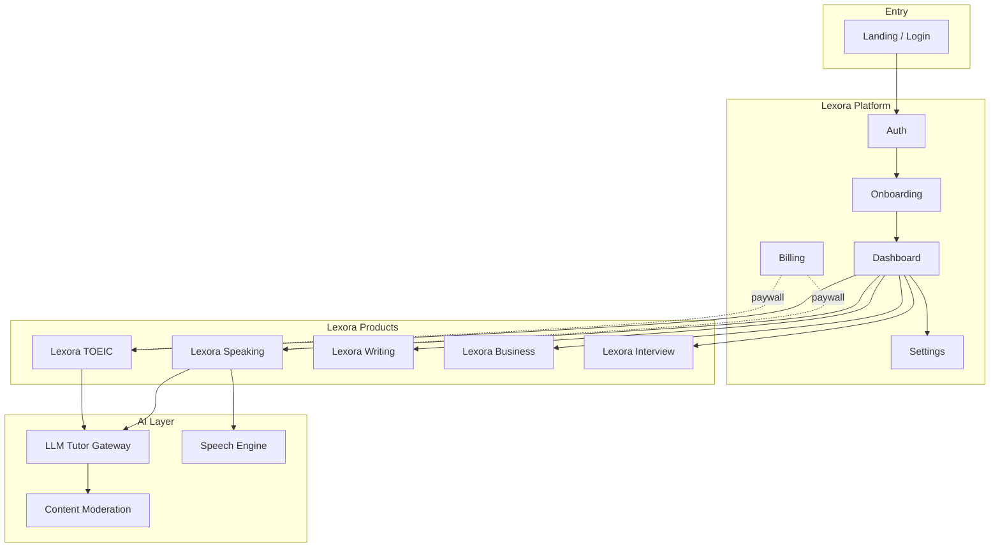

---

## 2. User Journey Overview

### 2.1 New Learner — First Session (Happy Path)

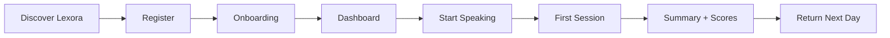

### 2.2 Returning Learner — Daily Practice

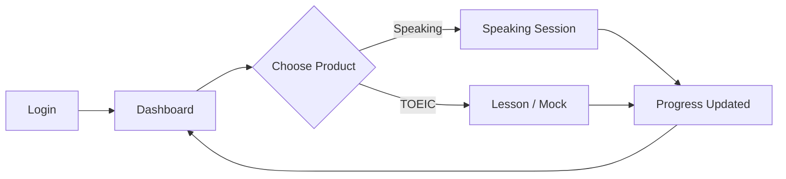

### 2.3 Free → Paid Conversion

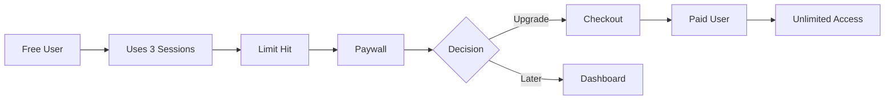

---

## 3. Platform Workflows

### 3.1 Overview — Authentication

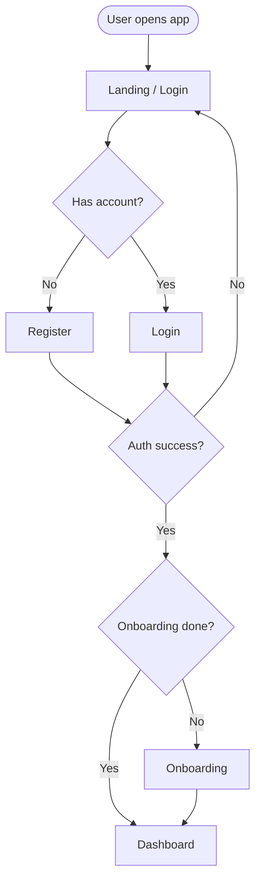

### 3.2 Detail — Registration Paths

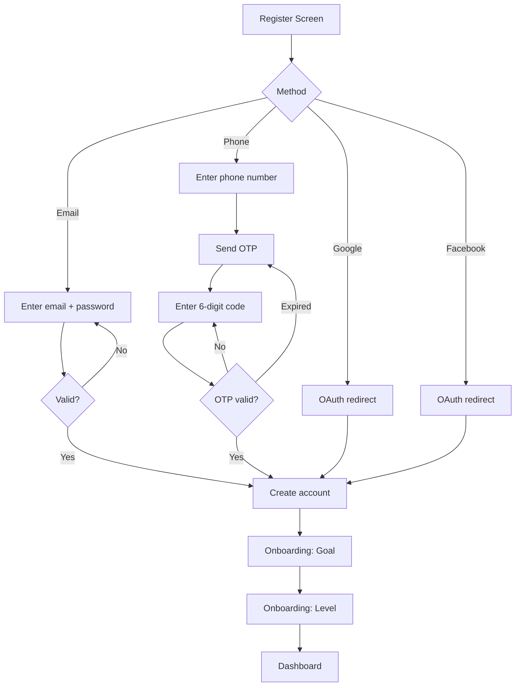

| Step | Screen | Route | Key action |
|---|---|---|---|
| 1 | Landing | `/` | Tap Register |
| 2a | Email register | `/register` | Submit form |
| 2b | Phone OTP | `/login/phone` | Verify OTP |
| 2c | OAuth | external | Callback |
| 3 | Goal | `/onboarding/goal` | Select 1 goal |
| 4 | Level | `/onboarding/level` | Select A1–C1 |
| 5 | Dashboard | `/dashboard` | Land |

### 3.3 Detail — Login (Returning User)

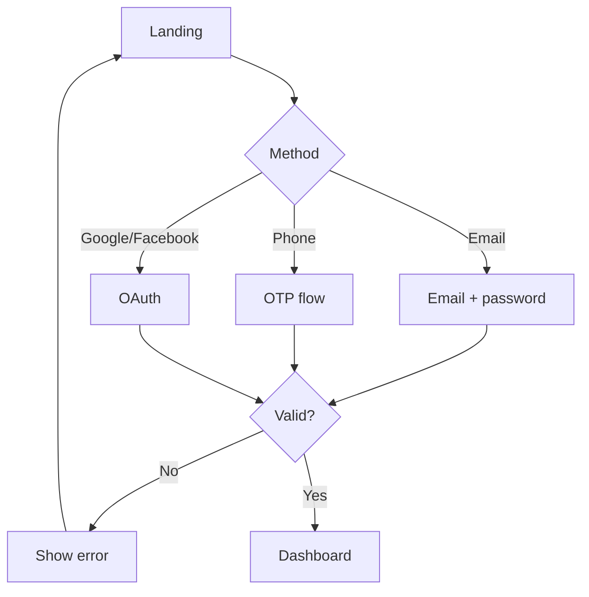

### 3.4 Overview — Onboarding

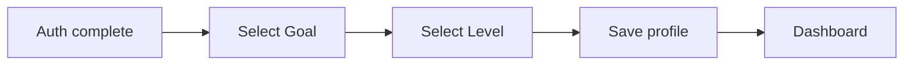

### 3.5 Detail — Onboarding

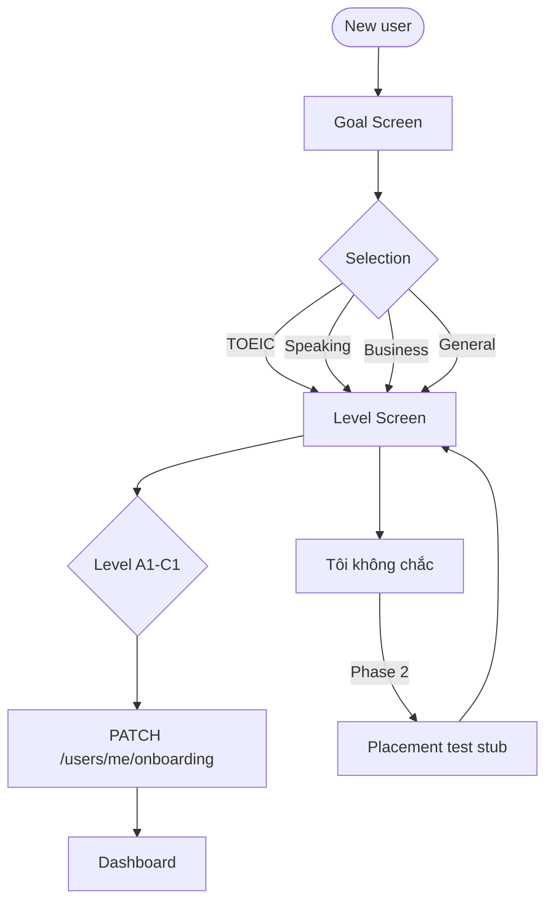

**Goal options:**

| ID | Label (VI) | Product emphasis |
|---|---|---|
| toeic | Luyện thi TOEIC | Lexora TOEIC card highlighted |
| speaking | Luyện nói | Lexora Speaking highlighted |
| business | Tiếng Anh công việc | Business + Speaking |
| general | Tiếng Anh tổng quát | All products equal |

---

## 4. Lexora Speaking Workflows

### 4.1 Overview — Speaking Journey

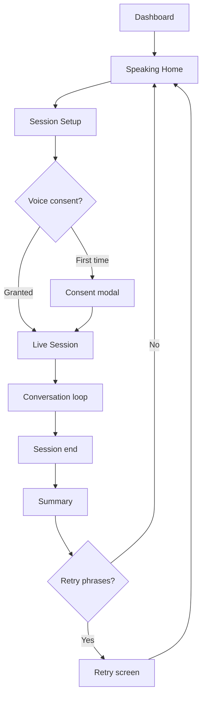

### 4.2 Detail — Session Setup

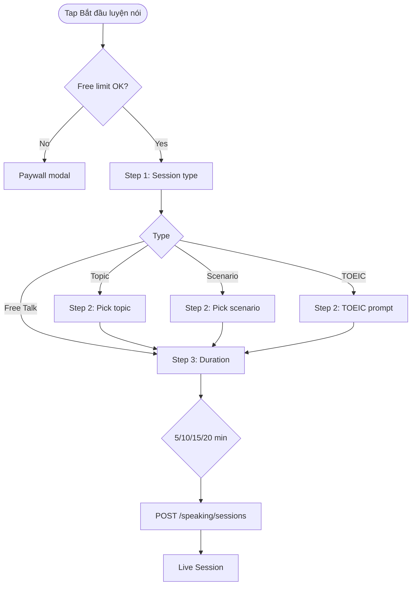

### 4.3 Detail — Live Session Loop

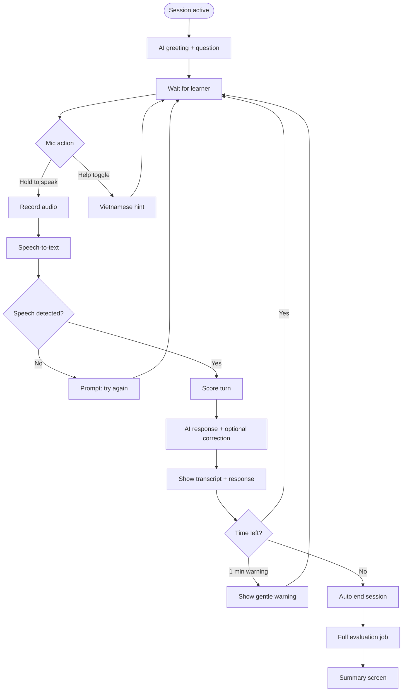

### 4.4 Detail — Voice Consent (First Time)

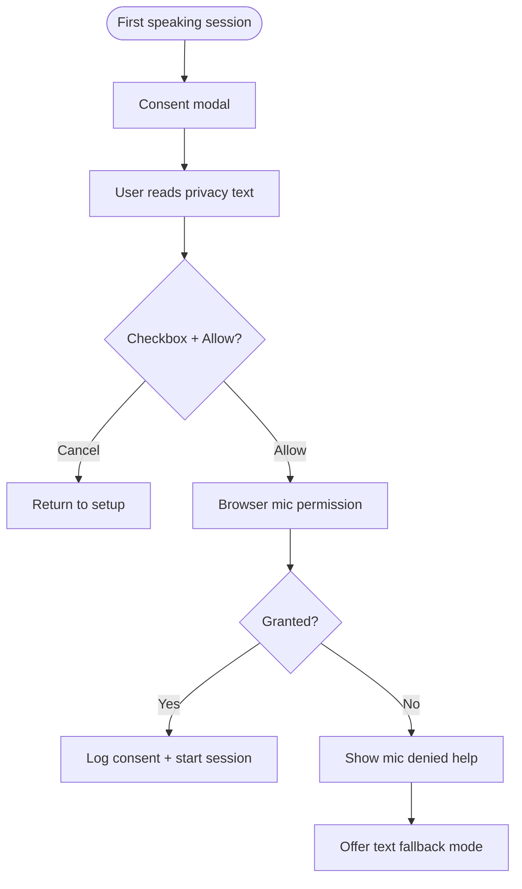

### 4.5 Detail — Session Summary

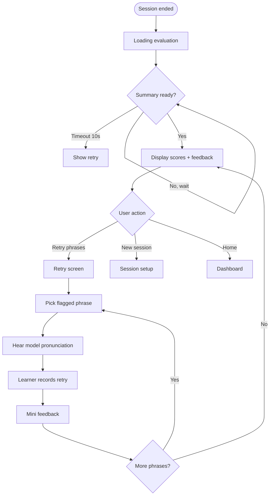

### 4.6 Error Paths — Speaking

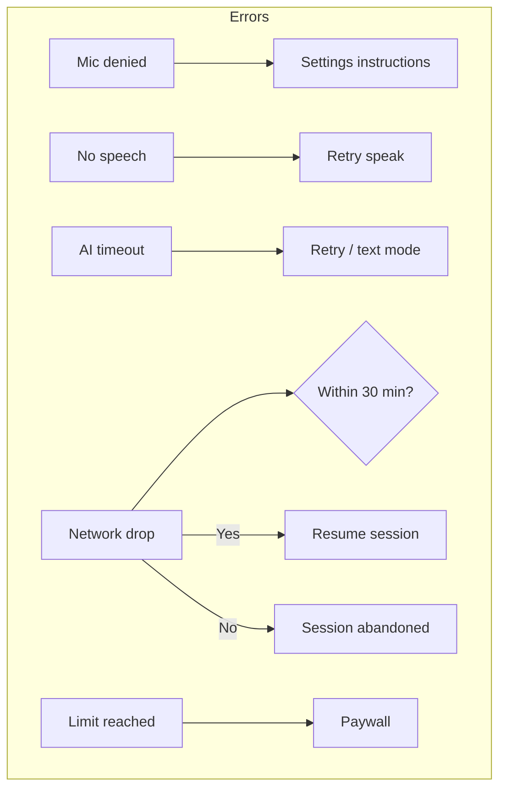

---

## 5. Lexora TOEIC Workflows

### 5.1 Overview — TOEIC Journey

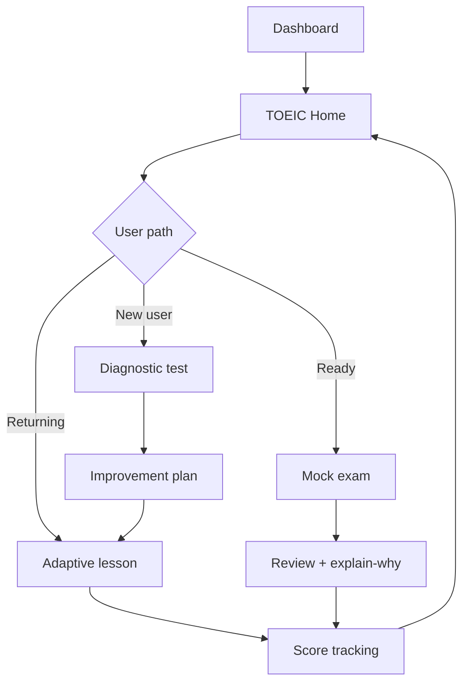

### 5.2 Detail — Diagnostic Test

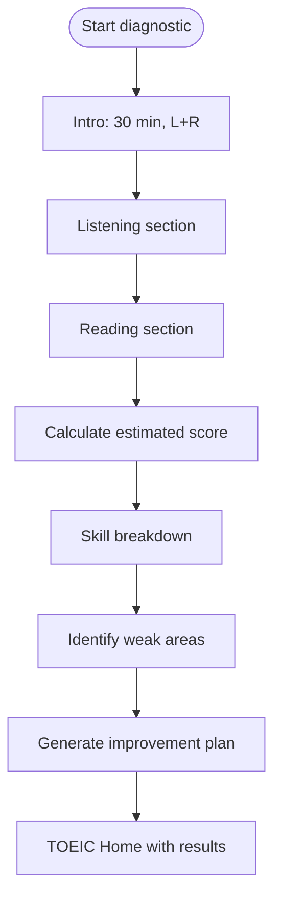

### 5.3 Detail — Mock Exam

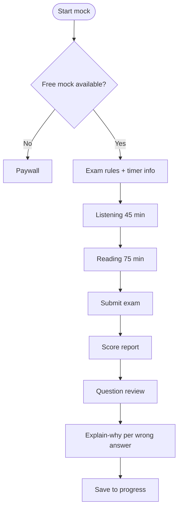

---

## 6. Billing & Paywall Workflows

### 6.1 Overview

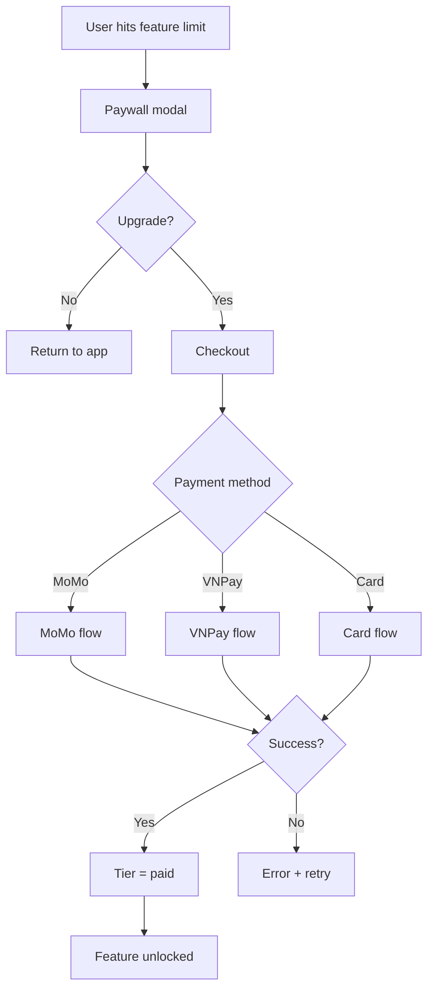

### 6.2 Detail — Paywall Trigger Points

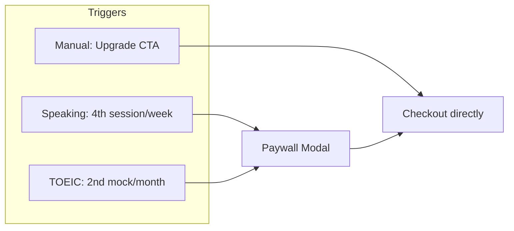

| Trigger | Free limit | Message (VI) |
|---|---|---|
| Speaking session | 3/week | "Bạn đã dùng hết 3 buổi luyện nói tuần này" |
| TOEIC mock | 1/month | "Nâng cấp để làm thi thử không giới hạn" |

---

## 7. Screen Map (Sitemap)

```mermaid
flowchart TD
    ROOT[/] --> REG[/register]
    ROOT --> LOGIN[/login]
    ROOT --> OTP[/login/phone]

    ROOT --> ONB1[/onboarding/goal]
    ONB1 --> ONB2[/onboarding/level]
    ONB2 --> DASH[/dashboard]

    DASH --> SP[/speaking]
    DASH --> TOEIC[/toeic]
    DASH --> SET[/settings]
    DASH --> CK[/checkout]

    SP --> SNEW[/speaking/new]
    SNEW --> SLIVE[/speaking/session/id]
    SLIVE --> SSUM[/speaking/session/id/summary]
    SSUM --> SRET[/speaking/session/id/retry]
    SP --> SPROG[/speaking/progress]

    TOEIC --> TDIAG[/toeic/diagnostic]
    TOEIC --> TLESS[/toeic/lesson/id]
    TOEIC --> TMOCK[/toeic/mock/id]
    TMOCK --> TRES[/toeic/mock/id/results]
```

---

## 8. State Diagrams

### 8.1 Speaking Session States

```mermaid
stateDiagram-v2
    [*] --> Created: POST /sessions
    Created --> Active: User enters live session
    Active --> Active: Conversation turns
    Active --> Ending: Timer ends / user ends
    Active --> Abandoned: 30 min inactive
    Ending --> Evaluating: POST /end
    Evaluating --> Completed: Summary ready
    Completed --> [*]
    Abandoned --> [*]
```

### 8.2 User Subscription States

```mermaid
stateDiagram-v2
    [*] --> Free: Registration
    Free --> Paid: Payment success
    Paid --> Paid: Renewal
    Paid --> Cancelled: User cancels
    Cancelled --> Free: Period ends
    Paid --> Free: Payment failed
```

### 8.3 Live Session UI States

```mermaid
stateDiagram-v2
    [*] --> Idle: AI finished speaking
    Idle --> Listening: User presses mic
    Listening --> Processing: User releases mic
    Processing --> Idle: AI response shown
    Listening --> Idle: No speech detected
    Processing --> Error: Timeout / network
    Error --> Idle: Retry
    Idle --> Ended: Timer zero
    Ended --> [*]
```

---

## 9. Flow Index (Quick Reference)

| Flow | Overview section | Detail section |
|---|---|---|
| System architecture | [§1](#1-system-overview) | — |
| New learner journey | [§2.1](#21-new-learner--first-session-happy-path) | [§3.2](#32-detail--registration-paths) |
| Login | [§3.1](#31-overview--authentication) | [§3.3](#33-detail--login-returning-user) |
| Onboarding | [§3.4](#34-overview--onboarding) | [§3.5](#35-detail--onboarding) |
| Speaking session | [§4.1](#41-overview--speaking-journey) | [§4.2–4.5](#42-detail--session-setup) |
| Speaking errors | — | [§4.6](#46-error-paths--speaking) |
| TOEIC | [§5.1](#51-overview--toeic-journey) | [§5.2–5.3](#52-detail--diagnostic-test) |
| Billing | [§6.1](#61-overview) | [§6.2](#62-detail--paywall-trigger-points) |
| All screens | [§7](#7-screen-map-sitemap) | — |
| Session/subscription states | [§8](#8-state-diagrams) | — |

---

## 10. Related Documents

| Document | Purpose |
|---|---|
| [`design-system.md`](design-system.md) | Colors, typography, components |
| [`ux-platform.md`](ux-platform.md) | Platform screen specs |
| [`ux-speaking.md`](ux-speaking.md) | Speaking screen specs |
| [`../product/speaking/prd-speaking.md`](../product/speaking/prd-speaking.md) | Speaking requirements |
| [`../product/platform/prd-platform.md`](../product/platform/prd-platform.md) | Platform requirements |
| [`../product/toeic/prd-toeic.md`](../product/toeic/prd-toeic.md) | TOEIC requirements |

---

## 11. Changelog

| Version | Date | Changes |
|---|---|---|
| 1.0 | 2026-07-19 | Initial overview + detail workflows for Platform, Speaking, TOEIC, Billing |
