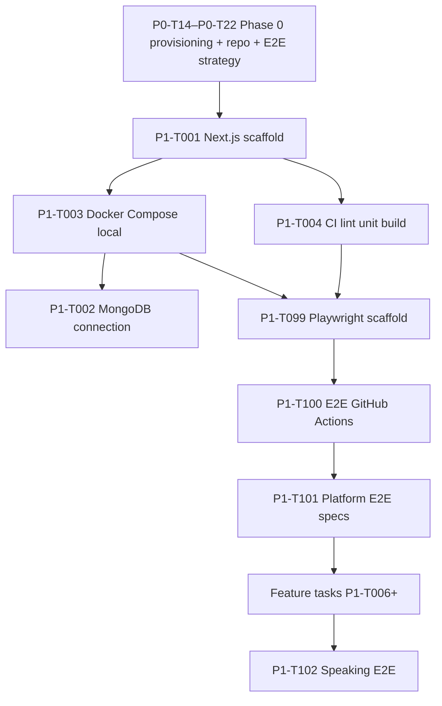

# Build & Setup Plan — Lexora AI

**Version:** 1.0
**Status:** Plan — **not implemented**
**Owner:** Technical Lead
**Last Updated:** 2026-07-19

> **Single map:** what to build/setup, in what order, which task, which doc. **No code until the task runs.**

**Hub:** [`docs/README.md`](../README.md) · **Tasks:** [`phases/phase-1-mvp-launch.md`](../product/phases/phase-1-mvp-launch.md)

**Repository:** [github.com/anhthqb97/Lexora-AI](https://github.com/anhthqb97/Lexora-AI)

---

## 1. Overview

| Area | Spec doc | Setup tasks | First sprint |
|---|---|---|---|
| **Tech stack** | [`tech-stack.md`](tech-stack.md) | P1-T001 | Sprint 1 |
| **Local Docker** | [`local-development.md`](local-development.md) | P1-T003 | Sprint 1 |
| **CI (unit + build)** | [`ci-cd.md`](ci-cd.md) | P1-T004 | Sprint 1 |
| **Cloud staging** | [`infra-environments.md`](infra-environments.md) | P0-T14–P0-T20 | Phase 0 |
| **E2E automation** | [`test-automation-e2e.md`](../qa/test-automation-e2e.md) | P1-T099–P1-T103 | Sprint 2–8 |
| **CI (E2E gate)** | [`ci-cd.md`](ci-cd.md) | P1-T100 | Sprint 2 |
| **Dev workflow** | [`development-rules.md`](development-rules.md) | — | Always |

---

## 2. Setup order (do not skip)



**Gate:** Do not start feature code (auth, speaking) until **P1-T001 + P1-T004** are done. Do not push UI flows without **P1-T099 + P1-T100** (after Sprint 2).

---

## 3. Tech stack → setup task map

| Stack item | Technology | Setup task | Deliverable |
|---|---|---|---|
| App framework | Next.js 15 + TypeScript | P1-T001 | `app/`, `lib/modules/*` |
| UI | Tailwind + shadcn | P1-T008 | Design system components |
| Database | MongoDB + Mongoose | P1-T002, P1-T091 | `lib/db/`, indexes |
| Cache | Redis (Upstash / local) | P1-T088, P1-T003 | `lib/redis.ts`, Docker Redis |
| Auth | Auth.js v5 | P1-T007, P1-T006 | `lib/auth.ts` |
| LLM prod | OpenAI GPT-4o | P0-T17, P1-T018 | `lib/ai/` |
| LLM local | Ollama | P1-T003 | Docker Ollama |
| Speech | Azure Speech | P0-T16, P1-T021 | `lib/speech/azure` |
| Payments | MoMo + VNPay | P1-T025–P1-T026, P1-T097 | billing module + webhooks |
| Email / SMS | Resend + ESMS | P0-T18, P0-T19 | Auth emails + OTP |
| Errors | Sentry | P1-T005 | `@sentry/nextjs` |
| Analytics | PostHog | P1-T016 | Event schema |
| Logging | Pino | P1-T092 | `lib/logger.ts` |
| Hosting | Vercel | P0-T14, P1-T004 | Preview + staging |
| **Unit tests** | Vitest | P1-T004 | `vitest.config.ts` |
| **E2E tests** | Playwright | P1-T099 | `playwright.config.ts`, `e2e/` |
| **CI** | GitHub Actions | P1-T004, P1-T100 | `ci.yml`, `e2e.yml` |

Full stack reference: [`tech-stack.md`](tech-stack.md) §2.

---

## 4. Automation setup plan

### 4.1 Phase 0 — strategy & accounts

| Task | What to setup | Doc |
|---|---|---|
| P0-T10 | Test plans (manual cases) | `qa/test-plan-*.md` |
| P0-T14 | Vercel + Atlas staging + Upstash | [`infra-environments.md`](infra-environments.md) |
| P0-T15 | `.env.example` + secrets policy | [`tech-stack.md`](tech-stack.md) §10 |
| P0-T16–P0-T19 | Azure, OpenAI, email, SMS accounts | [`infra-environments.md`](infra-environments.md) §2 |
| P0-T21 | **Approve** E2E + CI strategy | [`test-automation-e2e.md`](../qa/test-automation-e2e.md) |

### 4.2 Sprint 1 — foundation automation

| Task | Layer | Deliverable |
|---|---|---|
| P1-T004 | CI | `.github/workflows/ci.yml` — lint, typecheck, **Vitest**, build |
| P1-T004 | Unit | `vitest.config.ts`, `npm run test` |
| P1-T003 | Local | `docker-compose.yml` — MongoDB, Redis, Ollama |
| P1-T003 | Local | `npm run local:setup`, `local:check` scripts |

**After Sprint 1:** Every PR runs unit tests + build. Local Docker works.

### 4.3 Sprint 2 — E2E automation

| Task | Layer | Deliverable |
|---|---|---|
| P1-T099 | E2E scaffold | `playwright.config.ts`, `e2e/fixtures/` |
| P1-T099 | npm scripts | `test:e2e`, `test:e2e:smoke`, `test:e2e:ui` |
| P1-T100 | CI E2E | `.github/workflows/e2e.yml` — smoke on PR |
| P1-T100 | npm scripts | `test:all` (lint + unit + e2e smoke) |
| P1-T101 | E2E specs | `e2e/platform/*` — auth, onboarding, dashboard |

**After Sprint 2:** PR merge blocked unless E2E smoke passes. Rule: finish code → write test → run automation → push ([`development-rules.md`](development-rules.md) §5.8).

### 4.4 Sprint 6 & 8 — product E2E

| Task | Coverage |
|---|---|
| P1-T102 | Speaking smoke — test-plan-speaking §7 |
| P1-T103 | TOEIC smoke — diagnostic + mock exam |
| P1-T059 | QA verify all E2E + mobile spot check |

### 4.5 Sprint 9 — production automation

| Task | What |
|---|---|
| P1-T095 | Production Vercel + Atlas deploy |
| P1-T096 | Domain + SSL |
| P1-T098 | DB backup policy |
| P1-T081 | Security review before prod |

---

## 5. Developer setup checklist (after Sprint 1 tasks land)

**Plan only — run when P1-T001–P1-T004 exist in repo:**

```bash
# 1. Clone + env
git clone https://github.com/anhthqb97/Lexora-AI.git
cd Lexora-AI
cp .env.example .env.local

# 2. Local stack (P1-T003)
npm run local:setup
npm run ollama:pull          # first time

# 3. App (P1-T001)
npm install
npm run dev                  # http://localhost:3000

# 4. Verify automation (P1-T004, P1-T099+)
npm run lint && npm run typecheck && npm run test
npm run test:e2e:smoke       # after Sprint 2
```

---

## 6. npm scripts (planned — all tasks)

| Script | Added in | Purpose |
|---|---|---|
| `dev` | P1-T001 | Next.js dev server |
| `build` | P1-T001 | Production build |
| `lint` | P1-T001 | ESLint |
| `typecheck` | P1-T001 | `tsc --noEmit` |
| `test` | P1-T004 | Vitest unit + integration |
| `docker:up` / `docker:down` | P1-T003 | Local services |
| `local:setup` / `local:check` | P1-T003 | Docker health |
| `ollama:pull` | P1-T003 | Pull dev LLM model |
| `test:e2e` | P1-T099 | Full Playwright |
| `test:e2e:smoke` | P1-T099 | CI smoke subset |
| `test:e2e:ui` | P1-T099 | Playwright UI mode |
| `test:all` | P1-T100 | Full local gate before push |

---

## 7. What exists today vs planned

| Item | Status |
|---|---|
| Tech stack doc | ✅ [`tech-stack.md`](tech-stack.md) |
| ADR / architecture | ✅ [`architecture-decision-record.md`](architecture-decision-record.md) |
| CI/CD spec | ✅ [`ci-cd.md`](ci-cd.md) — not built |
| E2E spec | ✅ [`test-automation-e2e.md`](../qa/test-automation-e2e.md) — not built |
| Local Docker spec | ✅ [`local-development.md`](local-development.md) — not built |
| Infra / env spec | ✅ [`infra-environments.md`](infra-environments.md) |
| Phase tasks | ✅ P0-T01–P0-T22, P1-T001–P1-T104 |
| Application code | 🔲 Starts **P1-T001** after M0 |
| Docker / CI / E2E code | 🔲 P1-T003, P1-T004, P1-T099, P1-T100 |

---

## 9. Source & environment setup tasks

### 9.1 Phase 0 — before any app code

| Task | Setup | Deliverable |
|---|---|---|
| **P0-T22** | GitHub source repo | [anhthqb97/Lexora-AI](https://github.com/anhthqb97/Lexora-AI) — protect `main`, PR required |
| **P0-T14** | Staging cloud env | Vercel project, Atlas staging URI, Upstash Redis |
| **P0-T15** | Env vars | `.env.example`, secrets policy (1Password / Vercel) |
| **P0-T16** | Azure Speech keys | `AZURE_SPEECH_KEY`, `AZURE_SPEECH_REGION` |
| **P0-T17** | OpenAI keys | `OPENAI_API_KEY`, billing alerts |
| **P0-T18** | Email provider | `RESEND_API_KEY`, sender domain |
| **P0-T19** | SMS OTP provider | SMS API key for +84 |
| **P0-T20** | Production env spec | [`infra-environments.md`](infra-environments.md) updated |

Env var list: [`tech-stack.md`](tech-stack.md) §10.

### 9.2 Sprint 1 — source + local env in repo

| Task | Setup | Deliverable |
|---|---|---|
| **P1-T001** | **Source scaffold** | Next.js, TypeScript, `lib/modules/*`, `.gitignore`, README |
| **P1-T003** | **Local env runtime** | `docker-compose.yml`, local check scripts |
| **P1-T002** | App ↔ staging DB | `MONGODB_URI` in Vercel + `.env.local` |
| **P1-T004** | CI env | GitHub Actions secrets, required checks on PR |
| **P1-T088** | Redis client | `REDIS_URL` local / Upstash staging |

### 9.3 Env files (planned)

| File | Created in | Purpose |
|---|---|---|
| `.env.example` | P0-T15 | Template — committed, no secrets |
| `.env.local` | Developer | Local overrides — **gitignored** |
| Vercel env (staging) | P0-T14 | Staging deployment vars |
| Vercel env (production) | P1-T095 | Prod deployment vars |

### 9.4 Quick reference — who sets up what

```
Phase 0  →  Repo (P0-T22) + cloud accounts + .env.example (P0-T15)
Sprint 1 →  Source code (P1-T001) + Docker (P1-T003) + connect staging (P1-T002)
Developer →  cp .env.example .env.local + npm run local:setup
```

---

## 10. References

| Document | Link |
|---|---|
| Tech stack | [`tech-stack.md`](tech-stack.md) |
| TDD platform | [`tdd-platform.md`](tdd-platform.md) |
| Development rules | [`development-rules.md`](development-rules.md) |
| CI/CD | [`ci-cd.md`](ci-cd.md) |
| E2E automation | [`../qa/test-automation-e2e.md`](../qa/test-automation-e2e.md) |
| Local dev | [`local-development.md`](local-development.md) |
| Infra | [`infra-environments.md`](infra-environments.md) |
| Phase 0 | [`../product/phases/phase-0-discovery.md`](../product/phases/phase-0-discovery.md) |
| Phase 1 | [`../product/phases/phase-1-mvp-launch.md`](../product/phases/phase-1-mvp-launch.md) |
