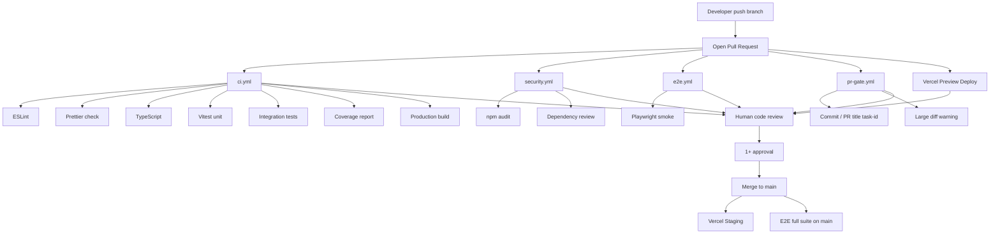

# CI/CD — Specification (Plan Only)

**Version:** 1.0
**Status:** Plan — **not implemented**
**Owner:** Technical Lead / DevOps
**Last Updated:** 2026-07-19
**Platform:** GitHub Actions + Vercel + GitHub PR reviews

> Implementation: **P1-T004** (CI + code quality), **P1-T100** (E2E), **P1-T104** (security + PR gates). See [`test-automation-e2e.md`](../qa/test-automation-e2e.md).

---

## 1. Pipeline overview

Every **Pull Request** runs automated checks **before** human code review. Merge is blocked until **all checks pass + 1 approval**.



---

## 2. Code review (human + automated)

### 2.1 Human code review (GitHub — P0-T22 + P1-T004)

Configure on `main` branch protection:

| Rule | Setting |
|---|---|
| Require pull request | ✅ Yes |
| Required approving reviews | **1** (TL or delegate) |
| Dismiss stale approvals | ✅ When new commits pushed |
| Require review from CODEOWNERS | ✅ When `CODEOWNERS` applies |
| Require conversation resolution | ✅ All threads resolved |
| Require status checks (see §3) | ✅ All must pass |
| Require linear history | Optional (squash merge OK) |
| Do not allow bypass | ✅ Including admins (recommended) |

**Reviewer checklist** (before Approve):

- [ ] PR title matches `{task-id}: description`
- [ ] Scope matches **one task** from phase plan
- [ ] Automated tests added/updated for the change
- [ ] No secrets, `.env`, or API keys in diff
- [ ] UX changes match design spec (if applicable)
- [ ] ADR / architecture not violated

### 2.2 Automated code review (GitHub Actions)

These run on every PR — failures block merge (same as tests):

| Check | Workflow | What it catches |
|---|---|---|
| ESLint | `ci.yml` | Code quality, unused vars, unsafe patterns |
| Prettier | `ci.yml` | Formatting drift |
| TypeScript | `ci.yml` | Type errors |
| Unit tests | `ci.yml` | Broken module logic |
| Integration tests | `ci.yml` | Broken API routes |
| Coverage diff | `ci.yml` | Coverage drop on changed files |
| npm audit | `security.yml` | Known vulnerable dependencies |
| Dependency review | `security.yml` | New risky dependencies on PR |
| PR title / commits | `pr-gate.yml` | Missing task-id, wrong format |
| E2E smoke | `e2e.yml` | Broken user flows |

**Optional (Phase 1c+):** Danger.js bot comment on PR, CodeQL, SonarCloud.

---

## 3. Required status checks on PR

Configure in **GitHub → Settings → Branches → main → Require status checks**:

| Status check name | Workflow | Task |
|---|---|---|
| `ci / lint` | ci.yml | P1-T004 |
| `ci / typecheck` | ci.yml | P1-T004 |
| `ci / test` | ci.yml | P1-T004 |
| `ci / build` | ci.yml | P1-T004 |
| `ci / coverage` | ci.yml | P1-T004 |
| `security / audit` | security.yml | P1-T104 |
| `e2e / smoke` | e2e.yml | P1-T100 |
| `pr-gate / validate` | pr-gate.yml | P1-T104 |
| Vercel | Vercel GitHub App | P1-T004 |

---

## 4. Workflow specs

### 4.1 `.github/workflows/ci.yml` — P1-T004

```yaml
# Planned — implement in P1-T004
name: CI

on:
  pull_request:
  push:
    branches: [main]

concurrency:
  group: ci-${{ github.ref }}
  cancel-in-progress: true

jobs:
  lint:
    runs-on: ubuntu-latest
    steps:
      - uses: actions/checkout@v4
      - uses: actions/setup-node@v4
        with: { node-version: '20', cache: 'npm' }
      - run: npm ci
      - run: npm run lint
      - run: npm run format:check    # Prettier — no write

  typecheck:
    runs-on: ubuntu-latest
    steps:
      - uses: actions/checkout@v4
      - uses: actions/setup-node@v4
        with: { node-version: '20', cache: 'npm' }
      - run: npm ci
      - run: npm run typecheck

  test:
    runs-on: ubuntu-latest
    steps:
      - uses: actions/checkout@v4
      - uses: actions/setup-node@v4
        with: { node-version: '20', cache: 'npm' }
      - run: npm ci
      - run: npm run test -- --coverage
      - uses: actions/upload-artifact@v4
        with:
          name: coverage-report
          path: coverage/

  build:
    runs-on: ubuntu-latest
    needs: [lint, typecheck, test]
    steps:
      - uses: actions/checkout@v4
      - uses: actions/setup-node@v4
        with: { node-version: '20', cache: 'npm' }
      - run: npm ci
      - run: npm run build
```

**Planned npm scripts (P1-T004):**

| Script | Purpose |
|---|---|
| `npm run lint` | ESLint |
| `npm run format:check` | Prettier verify |
| `npm run typecheck` | `tsc --noEmit` |
| `npm run test` | Vitest unit + integration |
| `npm run build` | Next.js production build |

**DoD:** All jobs green on PR after P1-T001 scaffold.

---

### 4.2 `.github/workflows/security.yml` — P1-T104

```yaml
# Planned — implement in P1-T104
name: Security

on:
  pull_request:
  push:
    branches: [main]
  schedule:
    - cron: '0 6 * * 1'    # weekly Monday audit

jobs:
  audit:
    runs-on: ubuntu-latest
    steps:
      - uses: actions/checkout@v4
      - uses: actions/setup-node@v4
        with: { node-version: '20', cache: 'npm' }
      - run: npm ci
      - run: npm audit --audit-level=high
        continue-on-error: false

  dependency-review:
    runs-on: ubuntu-latest
    if: github.event_name == 'pull_request'
    steps:
      - uses: actions/checkout@v4
      - uses: actions/dependency-review-action@v4
        with:
          fail-on-severity: high
```

---

### 4.3 `.github/workflows/pr-gate.yml` — P1-T104

```yaml
# Planned — implement in P1-T104
name: PR Gate

on:
  pull_request:
    types: [opened, edited, synchronize, reopened]

jobs:
  validate:
    runs-on: ubuntu-latest
    steps:
      - name: Validate PR title (strict)
        run: |
          TITLE="${{ github.event.pull_request.title }}"
          echo "$TITLE" | grep -qE '^(P0-T[0-9]+|P1-T[0-9]+|P1C-T[0-9]+|P2-T[0-9]+|P3-T[0-9]+): [a-z0-9][a-z0-9 /-]{2,71}$' \
            || (echo "PR title must match strict format — see development-rules.md §3" && exit 1)

      - name: Validate all PR commits (strict)
        uses: actions/checkout@v4
        with: { fetch-depth: 0 }
      - run: |
          BASE="${{ github.event.pull_request.base.sha }}"
          HEAD="${{ github.event.pull_request.head.sha }}"
          REGEX='^(P0-T[0-9]+|P1-T[0-9]+|P1C-T[0-9]+|P2-T[0-9]+|P3-T[0-9]+): [a-z0-9][a-z0-9 /-]{2,71}$'
          FORBIDDEN='Co-authored-by:|Generated-by|Created-with|AI-assisted|fine-tune|trainer|As an AI'
          git log --format=%s "${BASE}..${HEAD}" | while read -r msg; do
            echo "$msg" | grep -qE "$REGEX" || { echo "Invalid commit: $msg"; exit 1; }
            echo "$msg" | grep -qiE "$FORBIDDEN" && { echo "Forbidden pattern in: $msg"; exit 1; }
          done
```

---

### 4.4 `.github/workflows/e2e.yml` — P1-T100

```yaml
# Planned — implement in P1-T100
name: E2E

on:
  pull_request:
  push:
    branches: [main]

jobs:
  e2e-smoke:
    runs-on: ubuntu-latest
    steps:
      - uses: actions/checkout@v4
      - uses: actions/setup-node@v4
        with: { node-version: '20', cache: 'npm' }
      - run: npm ci
      - run: npx playwright install --with-deps
      - run: docker compose up -d mongodb redis
      - run: npm run build
      - run: npm run test:e2e:smoke
      - uses: actions/upload-artifact@v4
        if: failure()
        with:
          name: playwright-report
          path: playwright-report/

  e2e-full:
    if: github.ref == 'refs/heads/main'
    needs: [e2e-smoke]
    runs-on: ubuntu-latest
    steps:
      - uses: actions/checkout@v4
      - run: npm ci && npx playwright install --with-deps
      - run: npm run test:e2e
        env:
          BASE_URL: ${{ secrets.STAGING_URL }}
```

---

### 4.5 `.github/CODEOWNERS` — P1-T104

```
# Planned — implement in P1-T104
*                       @tech-lead-github-handle
/docs/                  @pm-github-handle @tech-lead-github-handle
/lib/modules/           @tech-lead-github-handle
/.github/               @tech-lead-github-handle
/e2e/                   @qa-lead-github-handle @tech-lead-github-handle
```

---

### 4.6 `.github/pull_request_template.md` — P1-T104

```markdown
## Task
- **Task ID:** P1-T___
- **Phase plan:** docs/product/phases/___

## Summary
<!-- What changed and why -->

## Testing
- [ ] Unit/integration tests added or updated
- [ ] E2E updated (if UI/flow changed)
- [ ] Ran locally: `npm run lint && npm run typecheck && npm run test`
- [ ] Ran locally: `npm run test:e2e:smoke` (if applicable)

## Checklist
- [ ] One task only — one commit format
- [ ] No secrets in diff
- [ ] Task marked in phase plan when merged
```

---

## 5. Full PR lifecycle

```
1. Developer finishes code + tests locally
2. Push branch → open PR (title: P1-T036: implement speak loop)
3. GitHub Actions run automatically:
   - ci.yml        → lint, format, typecheck, test, build
   - security.yml  → npm audit, dependency review
   - pr-gate.yml   → task-id validation
   - e2e.yml       → Playwright smoke (after P1-T099)
   - Vercel        → preview URL
4. Developer fixes any red checks
5. Human reviewer checks code + preview URL + tests
6. Reviewer approves PR
7. Squash merge to main → staging deploy + E2E full on main
```

**No merge if:** any Action red · no approval · unresolved threads · CI skipped without TL OK.

---

## 6. When workflows run

| Event | ci | security | pr-gate | e2e smoke | e2e full | Deploy |
|---|---|---|---|---|---|---|
| PR opened/updated | ✅ | ✅ | ✅ | ✅ | ❌ | Vercel preview |
| Merge to `main` | ✅ | ✅ | — | ✅ | ✅ | Vercel staging |
| Weekly cron | — | ✅ audit | — | — | — | — |
| Manual prod | — | — | — | — | ✅ | Vercel prod (P1-T095) |

---

## 7. Artifacts & reporting

| Artifact | When | Retention |
|---|---|---|
| Coverage report | Every PR | 7 days |
| Playwright HTML report | E2E fail | 14 days |
| Build logs | GitHub default | 90 days |

**Optional:** PR comment bot with coverage diff + preview URL (Vercel bot handles preview).

---

## 8. Related tasks

| Task | Deliverable |
|---|---|
| P0-T22 | Branch protection + required checks list |
| P0-T21 | Approve this CI/CD strategy |
| P1-T004 | `ci.yml`, npm scripts, Vercel integration |
| P1-T099 | Playwright config |
| P1-T100 | `e2e.yml` |
| **P1-T104** | `security.yml`, `pr-gate.yml`, `CODEOWNERS`, PR template |
| P1-T101–P102 | E2E spec files |

---

## 9. Developer rules

1. Finish code → write tests → run locally → push
2. Open PR — wait for **all** Actions green
3. Request review from TL / CODEOWNER
4. Fix review comments + push → checks re-run automatically
5. Merge only when green + approved

```bash
# Local gate (before push)
npm run lint && npm run format:check && npm run typecheck && npm run test
npm run test:e2e:smoke   # if UI changed
```

---

## 10. References

| Document | Link |
|---|---|
| E2E automation | [`../qa/test-automation-e2e.md`](../qa/test-automation-e2e.md) |
| Development rules | [`development-rules.md`](development-rules.md) |
| Build setup | [`build-setup-plan.md`](build-setup-plan.md) |
| Phase 1 tasks | [`../product/phases/phase-1-mvp-launch.md`](../product/phases/phase-1-mvp-launch.md) |

---

## 11. Approval (P0-T21)

| Role | Date | Status |
|---|---|---|
| QA Lead | 2026-07-19 | ✅ Approved |
| Technical Lead | 2026-07-19 | ✅ Approved |

**Agreed:** Playwright for E2E · Required PR checks: `ci.yml`, `security.yml`, `e2e.yml` (smoke), `pr-gate.yml` · Full implementation in P1-T004, P1-T100, P1-T104.
