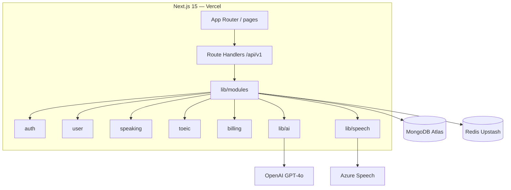

# TDD — Lexora Platform

**Feature:** Platform
**Version:** 1.0
**Status:** Approved baseline
**Last Updated:** 2026-07-19

**Architecture:** Modular monolith (MVP) — see [`architecture-decision-record.md`](architecture-decision-record.md)

---

## 1. Architecture Overview — MVP

Single **Next.js 15** application. Business logic in **`lib/modules/*`**. Route handlers are thin wrappers. One **MongoDB Atlas** cluster. **OpenAI** + **Azure Speech** for AI.



**Target architecture (Phase 2):** [`tech-stack.md`](tech-stack.md) § Target

---

## 2. Tech Stack (MVP)

| Layer | Technology |
|---|---|
| App | Next.js 15 (App Router) |
| Language | TypeScript |
| UI | Tailwind CSS + shadcn/ui |
| Database | MongoDB Atlas + Mongoose |
| Cache | Redis (Upstash) |
| Auth | Auth.js v5 |
| LLM | OpenAI GPT-4o (Ollama for local dev) |
| Speech | Azure Speech Services |
| Payments | MoMo + VNPay |
| Hosting | Vercel |
| CI/CD | GitHub Actions (lint, unit, E2E smoke on PR) |
| E2E | Playwright |

**Canonical reference:** [`tech-stack.md`](tech-stack.md)

---

## 3. Project Structure

```
lexora-ai/
├── app/
│   ├── (auth)/
│   ├── (dashboard)/
│   └── api/v1/
│       ├── auth/[...]/route.ts
│       ├── users/[...]/route.ts
│       ├── speaking/[...]/route.ts
│       ├── toeic/[...]/route.ts
│       └── billing/[...]/route.ts
├── lib/
│   ├── modules/
│   │   ├── auth/           # → future auth-service
│   │   │   ├── service.ts
│   │   │   ├── models.ts
│   │   │   └── types.ts
│   │   ├── user/
│   │   ├── speaking/
│   │   ├── toeic/
│   │   └── billing/
│   ├── ai/
│   │   ├── client.ts       # OpenAI wrapper
│   │   ├── prompts.ts      # load from docs/AI/
│   │   └── guardrails.ts
│   ├── speech/
│   │   └── azure.ts        # → future speech-service
│   ├── db/
│   │   └── mongoose.ts
│   └── auth.ts
├── components/
└── docs/
```

### Module boundary rules

1. Modules **never** import from other modules' internals — use public `service.ts` exports only
2. Route handlers: validate → call module → return response (≤20 lines)
3. Shared types in `lib/modules/{name}/types.ts`
4. Cross-module calls go through service interfaces (prepare for HTTP extraction)

---

## 4. Auth Module

**Path:** `lib/modules/auth/` + `app/api/v1/auth/`

| Method | Path | Description |
|---|---|---|
| POST | `/api/v1/auth/register` | Email + password signup |
| POST | `/api/v1/auth/login` | Email login |
| POST | `/api/v1/auth/otp/send` | Send phone OTP |
| POST | `/api/v1/auth/otp/verify` | Verify OTP |
| POST | `/api/v1/auth/oauth/{provider}` | Google/Facebook |
| POST | `/api/v1/auth/refresh` | Refresh token |
| POST | `/api/v1/auth/logout` | Logout |
| POST | `/api/v1/auth/password/reset` | Password reset |

Auth.js manages sessions; MongoDB adapter for users. JWT for API if needed by future mobile client.

---

## 5. User Module

**Path:** `lib/modules/user/` + `app/api/v1/users/`

| Method | Path | Description |
|---|---|---|
| GET | `/api/v1/users/me` | Profile |
| PATCH | `/api/v1/users/me` | Update profile |
| POST | `/api/v1/users/me/onboarding` | Goal + level |
| DELETE | `/api/v1/users/me` | Delete account |

---

## 6. Billing Module

**Path:** `lib/modules/billing/` + `app/api/v1/billing/`

| Method | Path | Description |
|---|---|---|
| GET | `/api/v1/billing/plans` | Plans |
| GET | `/api/v1/billing/subscription` | Current plan |
| POST | `/api/v1/billing/checkout` | Start payment |
| POST | `/api/v1/billing/webhook/momo` | MoMo webhook |
| POST | `/api/v1/billing/webhook/vnpay` | VNPay webhook |
| POST | `/api/v1/billing/cancel` | Cancel |

Use MongoDB **transactions** for payment confirmation + tier update.

---

## 7. AI Gateway (lib/ai)

Not a separate deploy in MVP — module inside monolith. Extract to **ai-gateway-service** in Phase 2.

| Method | Path | Description |
|---|---|---|
| POST | `/api/v1/ai/chat` | Product-scoped LLM call |

**Responsibilities:**
- Load prompts from `docs/AI/tutor-*-prompt.md`
- Apply [`guardrails.md`](../AI/guardrails.md)
- Call OpenAI GPT-4o (swap to LiteLLM later without route changes)
- Rate limit by tier via Redis
- Log prompt version per session

---

## 8. Security

- HTTPS only (Vercel)
- Passwords: bcrypt cost 12
- Rate limit: 5 login attempts / 15 min / IP (Redis)
- OTP: 6 digits, 5 min expiry
- PDPD: consent logged with timestamp
- AI keys server-side only

---

## 9. References

| Document | Link |
|---|---|
| ADR | [`architecture-decision-record.md`](architecture-decision-record.md) |
| Tech Stack | [`tech-stack.md`](tech-stack.md) |
| Data Model | [`data-model.md`](data-model.md) |
| API Contracts | [`api-contracts.md`](api-contracts.md) |
| PRD Platform | [`../product/platform/prd-platform.md`](../product/platform/prd-platform.md) |
