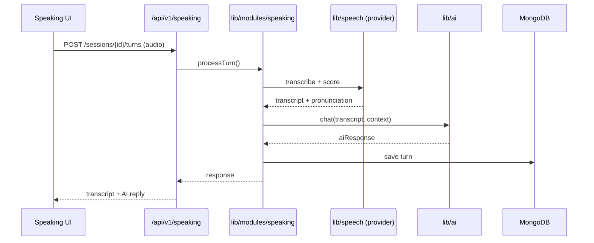

# TDD — Lexora Speaking

**Feature:** Lexora Speaking
**Version:** 1.0
**Status:** Approved baseline
**Last Updated:** 2026-07-19

**Architecture:** Module inside Next.js monolith (MVP) — `lib/modules/speaking/`

**Depends on:** Platform TDD, Feasibility Memo

---

## 1. Architecture — MVP

```
app/(dashboard)/speaking/     ← UI (client components for mic)
app/api/v1/speaking/          ← Route handlers
lib/modules/speaking/         ← Session, turn, summary logic
lib/ai/                       ← OpenAI tutor (→ future ai-gateway-service)
lib/speech/                     ← SpeechProvider (mock | whisper-local | azure)
  ├── index.ts                  ← getSpeechProvider()
  ├── mock.ts                   ← default local + CI
  ├── whisper-local.ts          ← optional real local STT
  └── azure.ts                  ← staging/prod (P1-T021, after P0-T16)
lib/db/                       ← Mongoose models
        ↓
MongoDB Atlas (speaking_* collections)
```



**Phase 2 extraction:** `lib/modules/speaking` → speaking-service; `lib/ai` → ai-gateway-service; `lib/speech` → speech-service. API contracts unchanged.

---

## 2. API Endpoints

| Method | Path | Module function |
|---|---|---|
| POST | `/api/v1/speaking/sessions` | `createSession()` |
| GET | `/api/v1/speaking/sessions/{id}` | `getSession()` |
| POST | `/api/v1/speaking/sessions/{id}/turns` | `processTurn()` |
| POST | `/api/v1/speaking/sessions/{id}/end` | `endSession()` |
| GET | `/api/v1/speaking/sessions/{id}/summary` | `getSummary()` |
| GET | `/api/v1/speaking/sessions` | `listSessions()` |
| GET | `/api/v1/speaking/progress` | `getProgress()` |
| GET | `/api/v1/speaking/topics` | `listTopics()` |
| GET | `/api/v1/speaking/scenarios` | `listScenarios()` |

---

## 3. Session Lifecycle

```
CREATED → ACTIVE → ENDING → EVALUATING → COMPLETED
                  ↘ ABANDONED (30 min inactive)
```

---

## 4. Evaluation Pipeline

1. Aggregate turn scores from SpeechProvider + LLM analysis
2. `lib/ai` generates explain-why summary from transcript
3. Store in `speaking_summaries` collection
4. Return to client (poll if async job > 3s)

**MVP LLM:** OpenAI GPT-4o. **Target:** LiteLLM → vLLM via extracted ai-gateway-service.

---

## 5. Performance Targets

| Operation | Target |
|---|---|
| Create session | ≤200ms |
| Turn (STT + LLM) | ≤3s p95 |
| Full evaluation | ≤5s p95 |
| Summary retrieval | ≤100ms |

---

## 6. References

| Document | Link |
|---|---|
| ADR | [`architecture-decision-record.md`](architecture-decision-record.md) |
| Feasibility | [`feasibility-speech.md`](feasibility-speech.md) |
| Speech providers | [`speech-providers.md`](speech-providers.md) |
| Data Model | [`data-model.md`](data-model.md) |
| Tutor Prompt | [`../AI/tutor-speaking-prompt.md`](../AI/tutor-speaking-prompt.md) |
