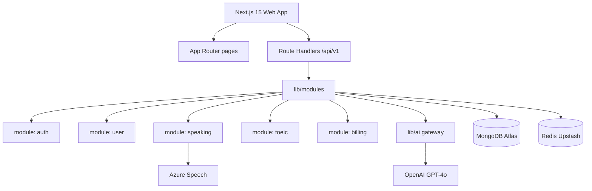
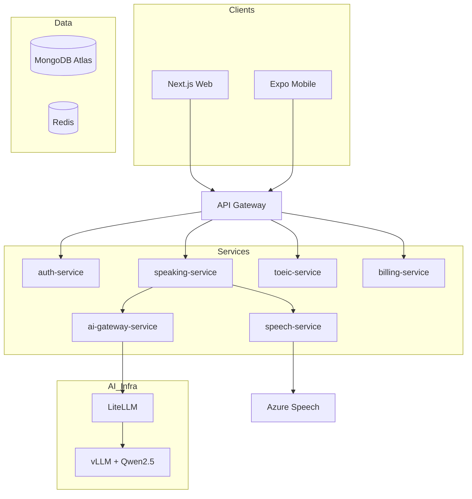

# Tech Stack — Lexora AI

**Version:** 1.0
**Status:** Approved
**Last Updated:** 2026-07-19

Evolutionary architecture: **MVP modular monolith now**, **target microservices later**.

> **Learn Smarter. Speak Better.**

**Related:** [`architecture-decision-record.md`](architecture-decision-record.md)

---

## 1. Two-Phase Strategy

| | **MVP (Phase 1 — Week 3–20)** | **Target (Phase 2+ — Month 4+)** |
|---|---|---|
| **Architecture** | Modular monolith | Microservices (extract on load) |
| **App** | Next.js 15 — one deploy | Next.js web + Expo mobile + services |
| **Database** | MongoDB Atlas — one cluster | Same; optional split by service |
| **LLM** | OpenAI GPT-4o (prod) + Ollama (dev) | Self-hosted vLLM + LiteLLM |
| **Speech (local)** | Mock + optional Whisper local | No Azure keys |
| **Speech (staging/prod)** | Azure Speech Services | P0-T16 · Sprint 3+ |
| **Mobile** | Responsive web only | Expo native app (Phase 1c) |
| **Hosting** | Vercel + Atlas + Upstash | Docker + K8s when MAL > 50K |
| **Team fit** | Small team, 20-week launch | Scale, privacy, App Store |

**Principle:** Design module boundaries in code today; split services when metrics force it.

---

## 2. MVP Stack (Build This First)

| Layer | Technology |
|---|---|
| **Framework** | Next.js 15 (App Router) — FE + BE |
| **Language** | TypeScript |
| **UI** | Tailwind CSS + shadcn/ui |
| **Database** | MongoDB Atlas (Singapore `ap-southeast-1`) |
| **ODM** | Mongoose |
| **Cache** | Redis (Upstash) |
| **Auth** | Auth.js v5 — email, OTP, Google, Facebook |
| **LLM (MVP)** | **OpenAI GPT-4o** — server-side only |
| **LLM (local dev)** | Ollama (`qwen2.5:14b` or `llama3.1:8b`) |
| **Speech (local dev)** | Mock (default) · optional faster-whisper Docker | [`speech-providers.md`](speech-providers.md) |
| **Speech (staging/prod)** | Azure Speech Services (STT + pronunciation) | P0-T16 · P1-T021 |
| **Payments** | MoMo + VNPay |
| **Email / SMS** | Resend + ESMS.vn |
| **Hosting** | Vercel |
| **Monitoring** | Sentry + PostHog |
| **CI/CD** | GitHub Actions — lint, format, test, security, E2E, code review on PR |
| **E2E testing** | Playwright |

---

## 3. MVP Architecture — Modular Monolith



**One repo. One deploy. Clear module folders** — extract to microservices without rewrite.

---

## 4. MVP Project Structure

```
lexora-ai/
├── app/
│   ├── (auth)/                 # login, register, onboarding
│   ├── (dashboard)/            # dashboard, speaking, toeic
│   └── api/v1/
│       ├── auth/               # thin route handlers
│       ├── users/
│       ├── speaking/
│       ├── toeic/
│       └── billing/
├── components/
├── lib/
│   ├── modules/
│   │   ├── auth/               # business logic — future auth-service
│   │   ├── user/
│   │   ├── speaking/
│   │   ├── toeic/
│   │   └── billing/
│   ├── ai/                     # LLM client, prompts, guardrails
│   ├── speech/                 # Azure Speech client — future speech-service
│   ├── db/                     # Mongoose connection + models
│   └── auth.ts                 # Auth.js config
├── docs/
├── docker-compose.yml          # MongoDB + Redis local
└── .github/workflows/
```

**Rule:** Route handlers only validate input and call `lib/modules/*`. No business logic in route files.

---

## 5. Target Architecture (Phase 2+)

Build toward this — do **not** deploy all services for MVP launch.



### Extraction order (when to split)

| Order | Service | Trigger |
|---|---|---|
| 1 | **ai-gateway-service** | OpenAI cost > $3K/mo OR PDPD requires in-region LLM |
| 2 | **speech-service** | STT/eval CPU bound; need independent scale |
| 3 | **billing-service** | Payment isolation; webhook hardening |
| 4 | auth, user, speaking, toeic | MAL > 50K; team > 8 engineers |

---

## 6. MongoDB

| MVP | Target |
|---|---|
| One Atlas cluster, Singapore | Same; optional DB-per-service |
| Collection prefixes per module | Unchanged |
| Mongoose schemas in `lib/modules/*/models` | Move with extracted service |

### Collections (one cluster)

| Module | Collections |
|---|---|
| auth | `users`, `auth_sessions`, `otp_codes` |
| user | `user_profiles`, `user_consents` |
| speaking | `speaking_sessions`, `speaking_turns`, `speaking_summaries` |
| toeic | `toeic_attempts`, `toeic_lessons`, `question_bank` |
| billing | `subscriptions`, `payments` |

**Billing rule:** Use MongoDB **transactions** for payment + subscription updates.

See [`data-model.md`](data-model.md).

---

## 7. AI Layer

### MVP (launch)

```
lib/modules/speaking → lib/ai/chat.ts → OpenAI GPT-4o
                      ↑ tutor-speaking-prompt.md
                      ↑ guardrails.md
lib/speech/azure.ts  → Azure Speech (STT + pronunciation)
```

### Target (scale)

```
speaking-service → ai-gateway-service → LiteLLM → vLLM (Qwen2.5 / Llama 3)
                → speech-service     → Azure Speech
```

| Environment | LLM |
|---|---|
| Local dev | Ollama |
| Staging / Production MVP | OpenAI GPT-4o |
| Production scale | Self-hosted vLLM + OpenAI fallback |

---

## 8. Mobile

| Phase | Delivery |
|---|---|
| **MVP launch (Week 20)** | Responsive Next.js web — iOS Safari, Android Chrome |
| **Phase 1c (Month 4+)** | Expo app — after beta retention ≥ 35% |
| **Phase 2** | Push notifications, offline mode |

Reuse same `/api/v1` contracts for Expo when built.

---

## 9. Infrastructure

| Environment | MVP | Target |
|---|---|---|
| **Local** | Docker Compose (MongoDB + Redis + Ollama) | + LiteLLM |
| **Staging** | Vercel preview + Atlas staging | K8s staging |
| **Production** | Vercel + Atlas + Upstash | K8s + GPU node pool |

**No Kubernetes for MVP.**

---

## 10. Environment Variables (MVP)

```bash
# Database
MONGODB_URI=mongodb+srv://...

# Redis
UPSTASH_REDIS_REST_URL=
UPSTASH_REDIS_REST_TOKEN=

# Auth
AUTH_SECRET=
AUTH_GOOGLE_ID=
AUTH_GOOGLE_SECRET=

# AI — MVP
OPENAI_API_KEY=

# AI — local dev only
OLLAMA_BASE_URL=http://localhost:11434

# Speech — local dev (no Azure)
SPEECH_PROVIDER=mock          # mock | whisper-local | azure

# Speech — staging/prod (P0-T16, Sprint 3+)
# AZURE_SPEECH_KEY=
# AZURE_SPEECH_REGION=southeastasia
# WHISPER_LOCAL_URL=http://localhost:8001   # if SPEECH_PROVIDER=whisper-local

# Payments
MOMO_PARTNER_CODE=
MOMO_SECRET_KEY=
VNPAY_TMN_CODE=
VNPAY_HASH_SECRET=

# App
NEXT_PUBLIC_APP_URL=https://lexora.ai
```

---

## 11. 90-Day Roadmap

| Period | Deliver | Architecture |
|---|---|---|
| Day 1–14 | Spikes, PRD sign-off, monolith scaffold | Next.js + MongoDB |
| Day 15–60 | Speaking MVP, auth, billing sandbox | Modular monolith |
| Day 61–90 | Closed beta 50 users, TOEIC diagnostic | OpenAI + Azure (after P0-T16) |
| Day 91+ | Extract ai-gateway; evaluate vLLM; Expo if metrics pass | First microservice |

---

## 12. References

| Document | Link |
|---|---|
| Architecture Decision Record | [`architecture-decision-record.md`](architecture-decision-record.md) |
| Build & setup plan | [`build-setup-plan.md`](build-setup-plan.md) |
| Infrastructure environments | [`infra-environments.md`](infra-environments.md) |
| Local development | [`local-development.md`](local-development.md) |
| CI/CD | [`ci-cd.md`](ci-cd.md) |
| Platform TDD | [`tdd-platform.md`](tdd-platform.md) |
| Speaking TDD | [`tdd-speaking.md`](tdd-speaking.md) |
| Data Model | [`data-model.md`](data-model.md) |
| API Contracts | [`api-contracts.md`](api-contracts.md) |
