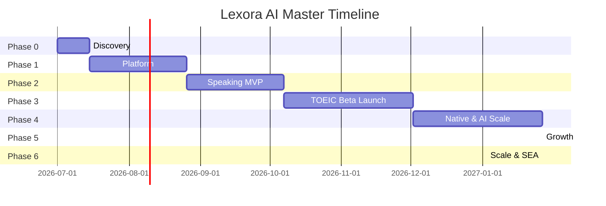

# Lexora AI — Master Plan

**Version:** 1.0
**Status:** Approved
**Owner:** Product Team
**Last Updated:** 2026-07-19
**Horizon:** 24 months (Phase 0 → Phase 6)

> **Learn Smarter. Speak Better.**

---

## 1. Vision & Goal

**Vision:** Become the most trusted AI English learning platform in Vietnam and expand across Southeast Asia.

**Master goal (24 months):**
- Launch Speaking + TOEIC MVP in Vietnam (Month 5)
- Reach 50,000 monthly active learners (Month 12)
- Expand to native apps + B2B pilots (Month 6–12)
- Scale to SEA markets (Month 18–24)

---

## 2. Phase Overview



| Phase | Name | Duration | Outcome | Detail doc |
|---|---|---|---|---|
| **0** | Discovery & Sign-off | 2 weeks | PRD approved, spikes pass, backlog ready | [`phases/phase-0-discovery.md`](phases/phase-0-discovery.md) |
| **1** | Platform Foundation | 6 weeks | Auth, billing, AI/speech infra, dashboard | [`phases/phase-1-platform.md`](phases/phase-1-platform.md) |
| **2** | Speaking MVP | 6 weeks | Full speaking loop, E2E, QA sign-off | [`phases/phase-2-speaking.md`](phases/phase-2-speaking.md) |
| **3** | TOEIC, Beta & Launch | 8 weeks | TOEIC mock, beta, public launch (M5) | [`phases/phase-3-toeic-launch.md`](phases/phase-3-toeic-launch.md) |
| **4** | Native & Scale | 8 weeks | Expo app, extract ai-gateway, LLM eval | [`phases/phase-4-native-scale.md`](phases/phase-4-native-scale.md) |
| **5** | Growth | 6 months | Writing, B2B pilots, IELTS, gamification | [`phases/phase-5-growth.md`](phases/phase-5-growth.md) |
| **6** | Scale & SEA | 12 months | Enterprise, Schools, Kids, regional expansion | [`phases/phase-6-scale-sea.md`](phases/phase-6-scale-sea.md) |

**MVP umbrella (Ph 1–3):** [`phases/phase-1-mvp-launch.md`](phases/phase-1-mvp-launch.md)

---

## 3. Architecture Evolution

| Phase | Architecture | Stack |
|---|---|---|
| 0–3 | Modular monolith | Next.js + MongoDB + OpenAI + Azure Speech + Vercel |
| 4 | First extractions | ai-gateway-service, optional speech-service, Expo mobile |
| 5 | Partial microservices | + billing-service |
| 6 | Full platform | K8s, self-hosted LLM, multi-region |

**Reference:** [`../engineering/architecture-decision-record.md`](../engineering/architecture-decision-record.md)

---

## 4. Product Roadmap by Phase

**Full feature list (28 modules, phased):** [`feature-catalog.md`](feature-catalog.md)

| Product | Ph 0 | Ph 1–3 | Ph 4 | Ph 5 | Ph 6 |
|---|---|---|---|---|---|
| Lexora Speaking | Plan | **Launch (Ph 2 build)** | Native app | Enhance | Scale |
| Lexora TOEIC | Plan | **Launch (Ph 3 build)** | Native app | IELTS/TOEFL | Scale |
| Lexora Writing | — | — | — | Launch | Scale |
| Lexora Business | — | — | — | Launch | Scale |
| Lexora Interview | — | — | — | Launch | Enterprise |
| Lexora for Schools | — | — | — | Pilot | Full LMS |
| Lexora Enterprise | — | — | — | — | Launch |
| Lexora Kids | — | — | — | — | Launch |

---

## 5. Master Milestones

| ID | Milestone | Target | Gate |
|---|---|---|---|
| M0 | Discovery complete | Week 2 | Local speech provider approved (P0-T02); PRD signed |
| M1 | Platform ready | Week 6 | Auth + AI pipeline in staging |
| M2 | Speaking MVP | Week 12 | E2E session, QA sign-off |
| M3 | Closed beta pass | Week 14 | Completion ≥60%, rating ≥3.8/5 |
| M4 | TOEIC core live | Week 16 | 1 mock exam works |
| M5 | **Public launch** | **Week 20** | Speaking + TOEIC + payments |
| M6 | Native app live | Month 7 | Expo on App Store + Play |
| M7 | 10K MAL | Month 9 | Retention ≥35% |
| M8 | B2B pilot | Month 12 | 10 English centers |
| M9 | 50K MAL | Month 12 | NPS ≥45 |
| M10 | SEA launch | Month 18 | Thailand or Indonesia live |

---

## 6. Success Metrics (12-Month Targets)

| Category | Metric | Target |
|---|---|---|
| Learners | Monthly Active Learners | 50,000 |
| Learners | 30-day retention | ≥35% |
| Learners | TOEIC score improvement (90d) | +50 points avg |
| Product | Session completion rate | ≥70% |
| Product | Feedback usefulness | ≥4.2/5 |
| Business | Paid conversion (30d) | ≥8% |
| Business | LTV:CAC | ≥6:1 |
| AI | Response latency (text) | ≤3s p95 |

**Source:** [`brand.md`](brand.md) § Success Metrics

---

## 7. Team (Minimum)

| Role | Phase 0–1 | Phase 2+ |
|---|---|---|
| Product Manager | 1 | 1 |
| System Architect | 1 | 1 |
| AI Engineer | 1 | 2 |
| Full-stack Developer | 2 | 3–4 |
| QA Lead | 0.5 | 1 |
| Designer | 0.5 | 1 |
| DevOps | — | 1 (Phase 4+) |

---

## 8. Dependency Map

```
Phase 0 (Discovery)
    ↓
Phase 1 (Platform) ── M1
    ↓
Phase 2 (Speaking MVP) ── M2
    ↓
Phase 3 (TOEIC + Beta + Launch) ── M3–M5
    ↓
Phase 4 (Native) ── requires retention ≥35%
    ↓
Phase 5 (Growth) ── requires MAL traction
    ↓
Phase 6 (Scale) ── requires B2B proof + revenue
```

**Critical path:** Local speech provider (P0-T02) → AI pipeline (Week 7) → Speaking E2E (Week 12) → Azure VN spike (pre-beta) → Beta (Week 14) → Launch (Week 20)

---

## 9. Risk Register (Master)

| # | Risk | Phase | Mitigation |
|---|---|---|---|
| R1 | VN-accent speech accuracy low | 0, 1 | Week 1 spike; Azure tuning |
| R2 | Over-engineering | 1 | ADR: modular monolith only |
| R3 | AI latency on 4G | 1 | Streaming; edge region Singapore |
| R4 | Payment delays | 1 | MoMo sandbox Week 3; soft launch fallback |
| R5 | Low beta retention | 3, 4 | UX iteration; defer native until ≥35% |
| R6 | OpenAI cost at scale | 4, 5 | Extract ai-gateway; vLLM evaluation |
| R7 | Team capacity | All | Strict P0 scope; cut TOEIC before Speaking |

---

## 10. Document Index

| Type | Document |
|---|---|
| **Master plan** | This file |
| **Phase plans** | [`phases/`](phases/) folder |
| **Doc hub** | [`../README.md`](../README.md) |
| **Client proposal** | [`../CLIENT-PROPOSAL.md`](../CLIENT-PROPOSAL.md) |
| **Final review** | [`../REVIEW-SIGNOFF.md`](../REVIEW-SIGNOFF.md) |
| **Dev rules** | [`../engineering/development-rules.md`](../engineering/development-rules.md) |
| **Build & setup** | [`../engineering/build-setup-plan.md`](../engineering/build-setup-plan.md) |
| Brand & requirements | [`brand.md`](brand.md) |
| Architecture | [`../engineering/architecture-decision-record.md`](../engineering/architecture-decision-record.md) |
| Tech stack | [`../engineering/tech-stack.md`](../engineering/tech-stack.md) |
| Speaking PRD | [`speaking/prd-speaking.md`](speaking/prd-speaking.md) |
| TOEIC PRD | [`toeic/prd-toeic.md`](toeic/prd-toeic.md) |
| Workflows | [`../design/workflow-overview-detail.md`](../design/workflow-overview-detail.md) |
| File plan | [`plan-by-feature.md`](plan-by-feature.md) |
| Feature catalog | [`feature-catalog.md`](feature-catalog.md) |

---

## 11. How to Use This Plan

1. Read [`development-rules.md`](../engineering/development-rules.md) — git, commit, code rules
2. **Start with Phase 0** — do not code until M0 passes
3. **One task = one commit** — format `{task-id}: {content}`
4. Track tasks in [`phases/`](phases/) — mark ✅ when committed
5. Gate reviews at M0, M1, M2, M3, M5

---

## 12. Quick Task Count by Phase

| Phase | Tasks (approx) | Focus |
|---|---|---|
| Phase 0 | 22 | Discovery, repo/env, infra, E2E strategy |
| Phase 1 | ~35 | Platform, auth, billing, CI |
| Phase 2 | ~35 | Speaking MVP + E2E |
| Phase 3 | ~35 | Beta, TOEIC, launch |
| Phase 4 | 22 | Native app + service extraction |
| Phase 5 | 32+ | Writing, B2B, IELTS, gamification |
| Phase 6 | 28+ | Enterprise, Schools, SEA |

See each phase file for full task lists. MVP build tasks (Ph 1–3) share prefix `P1-T*`.
